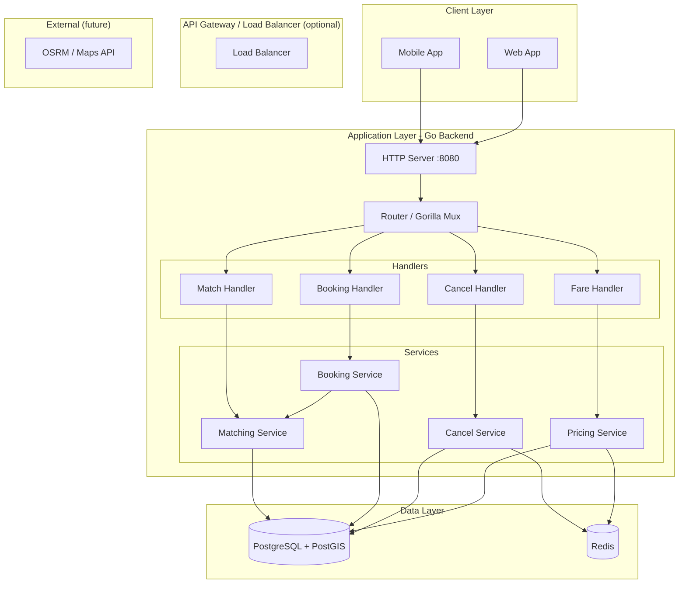

# High-Level Architecture

## 1. System Overview

```
┌─────────────────────────────────────────────────────────────────────────────────────────┐
│                           Smart Airport Ride Pooling System                              │
│                                                                                          │
│   Clients (Mobile App / Web)  ──────►  HTTP API  ──────►  Go Backend  ──────►  Data      │
└─────────────────────────────────────────────────────────────────────────────────────────┘
```

## 2. Architecture Diagram



## 3. Component Diagram

```
┌─────────────────────────────────────────────────────────────────────────────┐
│                         Hintro Backend                                       │
├─────────────────────────────────────────────────────────────────────────────┤
│                                                                              │
│  ┌─────────────┐  ┌─────────────┐  ┌─────────────┐  ┌─────────────────────┐ │
│  │   Match     │  │   Book      │  │   Cancel    │  │   Fare / Pricing    │ │
│  │   API       │  │   API       │  │   API       │  │   API               │ │
│  └──────┬──────┘  └──────┬──────┘  └──────┬──────┘  └──────────┬──────────┘ │
│         │                │                │                     │            │
│         ▼                ▼                ▼                     ▼            │
│  ┌─────────────┐  ┌─────────────┐  ┌─────────────┐  ┌─────────────────────┐ │
│  │  Matching   │  │  Booking    │  │   Cancel    │  │   Pricing           │ │
│  │  Service    │  │  Service    │  │   Service   │  │   Service           │ │
│  │             │  │             │  │             │  │                     │ │
│  │ • Greedy    │  │ • Match or  │  │ • Pending/  │  │ • Distance + Time   │ │
│  │   heuristic │  │   new trip  │  │   Matched   │  │ • Surge (D/S ratio) │ │
│  │ • Seat/     │  │ • Pessimistic│  │ • Free cab  │  │ • Redis cache       │ │
│  │   luggage   │  │   locking   │  │   if empty  │  │                     │ │
│  └──────┬──────┘  └──────┬──────┘  └──────┬──────┘  └──────────┬──────────┘ │
│         │                │                │                     │            │
│         └────────────────┴────────────────┴─────────────────────┘            │
│                                    │                                         │
│                                    ▼                                         │
│  ┌─────────────────────────────────────────────────────────────────────────┐│
│  │  Repositories: Ride | Booking | Pricing | RideRequest                    ││
│  └─────────────────────────────────────────────────────────────────────────┘│
│                                    │                                         │
└────────────────────────────────────┼─────────────────────────────────────────┘
                                     │
         ┌───────────────────────────┼───────────────────────────┐
         ▼                           ▼                           ▼
  ┌──────────────┐           ┌──────────────┐           ┌──────────────┐
  │  PostgreSQL  │           │    Redis     │           │  pkg/geo     │
  │  + PostGIS   │           │  (surge      │           │  (Haversine) │
  │              │           │   cache)     │           │              │
  │ • users      │           │              │           │ • Distance   │
  │ • cabs       │           │ • demand/    │           │ • Route time │
  │ • trips      │           │   supply     │           │ • Insertion  │
  │ • ride_      │           │ • 30s TTL    │           │   scoring    │
  │   requests   │           │              │           │              │
  └──────────────┘           └──────────────┘           └──────────────┘
```

## 4. Request Flow (High Level)

### Match Request
```
Client → POST /match/{id} → Handler → MatchingService → RideRepository → PostGIS
                                                    → geo.FindBestInsertion
                                              ← MatchResult / ErrNoMatch
```

### Book Request
```
Client → POST /book/{id} → Handler → BookingService → MatchingService (find or no match)
                                       → BookingRepository.CreateTrip (if no match)
                                       → BookingRepository.BookRide (FOR UPDATE tx)
                                              ← BookingResult / ErrCabFull
```

### Cancel Request
```
Client → POST /cancel/{id} → Handler → CancelService → BookingRepository.CancelRide
                                                       → PricingRepository.InvalidateSurge
```

### Fare Estimate
```
Client → POST /fare/estimate → Handler → PricingService → Redis (demand/supply)
                                                         → PostGIS (fallback)
                                                         → geo.Haversine
                                              ← FareEstimate
```

## 5. Deployment (Docker)

```
┌─────────────────────────────────────────────────────────────────┐
│                    docker-compose                                │
├─────────────────────────────────────────────────────────────────┤
│                                                                  │
│  ┌─────────────┐    ┌─────────────┐    ┌─────────────────────┐  │
│  │   hintro-   │    │   hintro-   │    │     hintro-app      │  │
│  │   postgres  │◄───│   redis     │◄───│                     │  │
│  │   :5432     │    │   :6379     │    │  Go binary          │  │
│  │             │    │             │    │  :8080               │  │
│  │ PostGIS 16  │    │ Redis 7     │    │  (connects to both)  │  │
│  └─────────────┘    └─────────────┘    └─────────────────────┘  │
│         │                   │                      │             │
│         └───────────────────┴──────────────────────┘             │
│                         depends_on                               │
└─────────────────────────────────────────────────────────────────┘
```

## 6. Scaling Considerations (10K Users, 100 RPS)

| Component     | Current                     | Scale-up for 10K users              |
|---------------|-----------------------------|-------------------------------------|
| App instances | 1                           | Horizontal: 5–10 replicas behind LB |
| PostgreSQL    | 1, MaxConns=50              | Increase MaxConns; read replicas    |
| Redis         | 1                           | Redis Cluster for HA                |
| Connection pool | 50 (PG), 100 (Redis)      | Tune per instance                   |

**100 RPS:** Single instance can handle; test_suite validates P95 < 300ms.  
**10K concurrent:** Requires multiple app instances + connection pooling.
