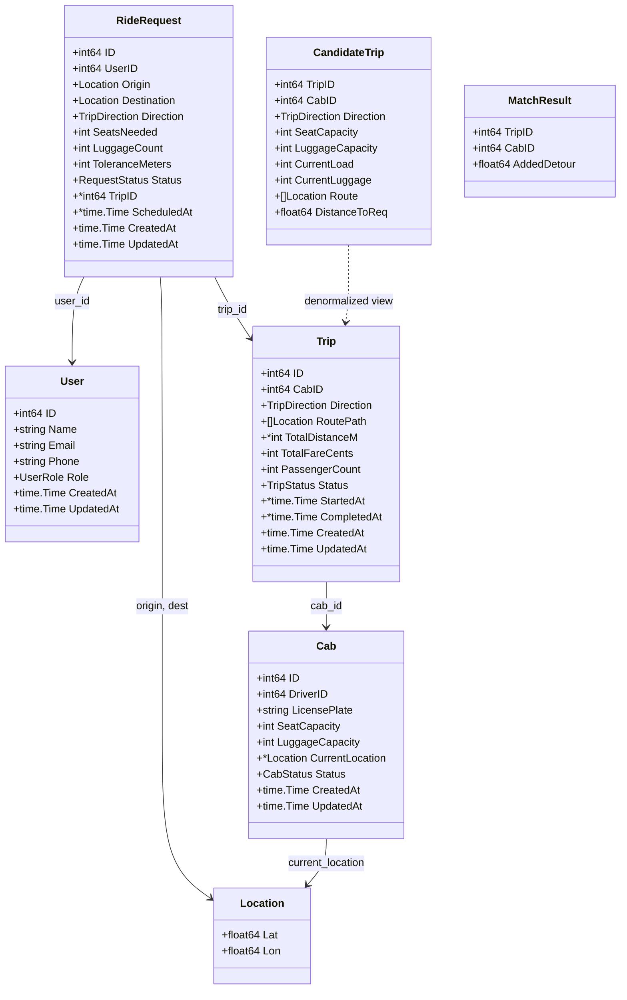
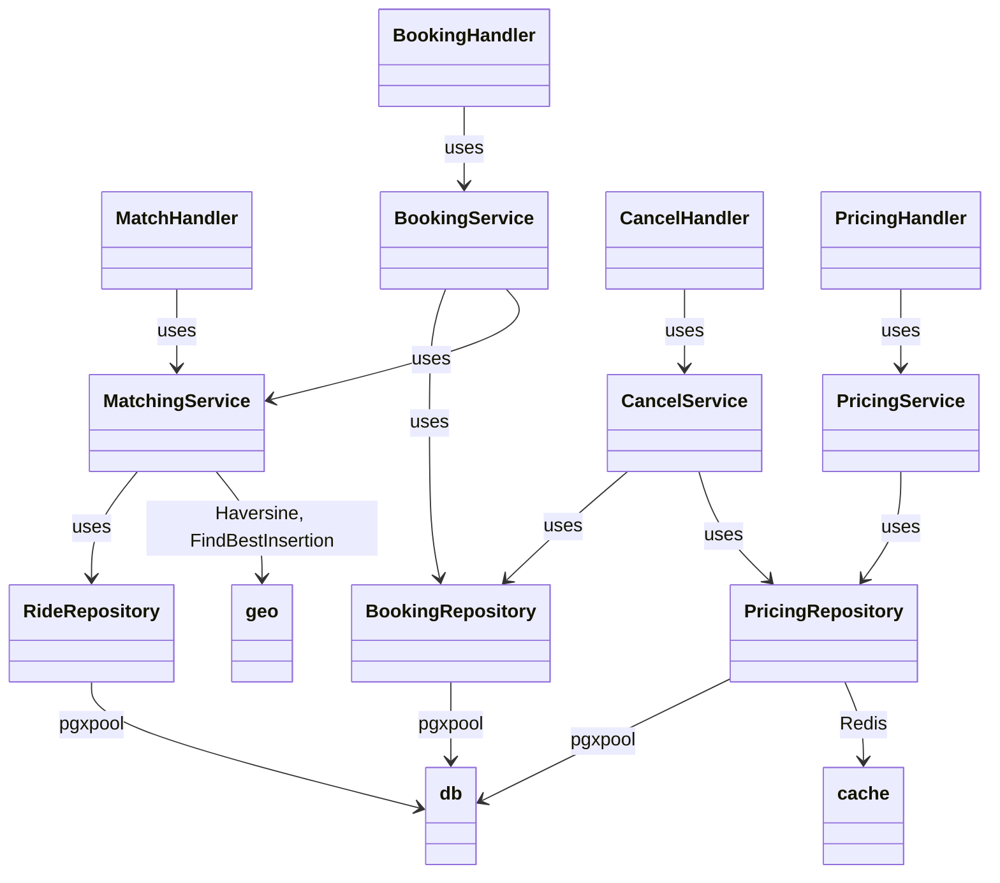
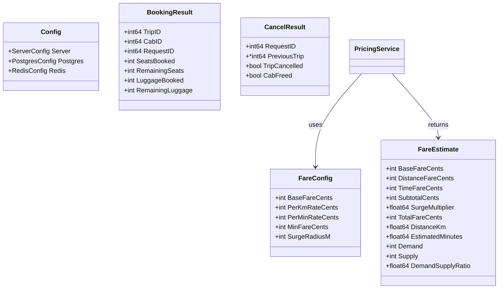

# Low-Level Design (LLD)

> **See also:** [High-Level Architecture](HIGH_LEVEL_ARCHITECTURE.md) for system overview and deployment.

## 1. Class / Struct Diagram

### 1.1 Package Overview

```
┌─────────────────────────────────────────────────────────────────────────────────┐
│                              cmd/server (main)                                   │
│  • Wires all layers via constructors (DI)                                        │
│  • Config, DB, Redis, Router                                                     │
└─────────────────────────────────────────────────────────────────────────────────┘
                                        │
         ┌──────────────────────────────┼──────────────────────────────┐
         ▼                              ▼                              ▼
┌─────────────────┐          ┌─────────────────────┐          ┌─────────────────┐
│    internal/    │          │    internal/        │          │      pkg/        │
│    handler      │◄─────────│    service          │◄─────────│  (geo, db, cache)│
│                 │          │                     │          │                  │
└────────┬────────┘          └──────────┬──────────┘          └────────┬─────────┘
         │                              │                              │
         │                              ▼                              │
         │                     ┌─────────────────────┐                 │
         │                     │  internal/repository│◄────────────────┘
         │                     │                     │
         │                     └──────────┬──────────┘
         │                                │
         │                                ▼
         │                     ┌─────────────────────┐
         └────────────────────►│  internal/model     │
                               │  (domain entities)  │
                               └─────────────────────┘
```

### 1.2 Domain Model (Structs)



### 1.3 Application Layer (Handlers, Services, Repositories)



### 1.4 Handler / Service / Repository Method Signatures

| Layer       | Struct             | Key Methods                                                                 |
|-------------|--------------------|-----------------------------------------------------------------------------|
| **Handler** | MatchHandler       | `MatchRideRequest(w, r)`                                                    |
|             | BookingHandler     | `BookRide(w, r)`                                                            |
|             | CancelHandler      | `CancelRide(w, r)`                                                          |
|             | PricingHandler     | `EstimateFare(w, r)`                                                        |
| **Service** | MatchingService    | `MatchRiders(ctx, requestID) (*MatchResult, error)`                         |
|             | BookingService     | `BookRide(ctx, requestID) (*BookingResult, error)`                          |
|             | CancelService      | `CancelRide(ctx, requestID) (*CancelResult, error)`                         |
|             | PricingService     | `EstimateFare(ctx, origin, dest) (*FareEstimate, error)`                    |
| **Repo**    | RideRepository     | `GetRideRequest`, `FindNearbyCandidateTrips`, `GetTripStops`                |
|             | BookingRepository  | `BookRide`, `CreateTrip`, `FindAvailableCabNear`, `CancelRide`              |
|             | PricingRepository  | `GetDemandSupply`, `InvalidateSurgeCache`                                   |
|             | RideRequestRepository | `CreateRideRequest`, `GetRideRequestByID`, `CancelRideRequest`           |
| **pkg**     | geo                | `HaversineKm`, `EstimateTimeMinutes`, `FindBestInsertionIndex`              |
|             | db                 | `NewPostgresPool`, `HealthCheck`                                            |
|             | cache              | `NewRedisClient`, `HealthCheck`                                             |

### 1.5 Config and DTOs



---

## 2. Design Patterns

### 2.1 Layered Architecture (N-Tier)

| Layer          | Package             | Responsibility                                  |
|----------------|---------------------|-------------------------------------------------|
| **Presentation** | `internal/handler`  | HTTP parsing, validation, response marshalling  |
| **Application**  | `internal/service`  | Business logic, orchestration, error mapping    |
| **Domain**       | `internal/model`    | Entities, value objects, enums                  |
| **Data Access**  | `internal/repository` | DB queries, transactions, spatial (PostGIS)  |
| **Infrastructure** | `pkg/`           | DB pool, Redis, geo utils                       |

### 2.2 Repository Pattern

**Intent:** Abstracts data access behind an interface-like boundary; keeps domain logic independent of persistence.

**Where:** `RideRepository`, `BookingRepository`, `PricingRepository`, `RideRequestRepository`

**Example:**
```go
// MatchingService depends on RideRepository, not on pgxpool directly
type MatchingService struct {
    Repo *repository.RideRepository
}
```

### 2.3 Dependency Injection (Constructor Injection)

**Intent:** Dependencies are passed in via constructors; no service locators or globals.

**Where:** All `NewXxx()` constructors — `NewMatchingService(repo)`, `NewBookingService(bookingRepo, matchingSvc)`, etc.

**Example:**
```go
matchingSvc := service.NewMatchingService(rideRepo)
bookingSvc := service.NewBookingService(bookingRepo, matchingSvc)
matchHandler := handler.NewMatchHandler(matchingSvc)
```

### 2.4 Data Transfer Object (DTO)

**Intent:** Structs used to transfer data between layers; often a subset or projection of domain models.

**Where:** `MatchResult`, `BookingResult`, `CancelResult`, `FareEstimate`, `CandidateTrip`, `FareRequest`, `CreateRideRequestBody`, `HealthResponse`

### 2.5 Application Service Pattern

**Intent:** Encapsulates use-case logic; coordinates repositories and domain logic.

**Where:** `MatchingService`, `BookingService`, `CancelService`, `PricingService`

### 2.6 Pessimistic Locking (Concurrency Control)

**Intent:** Prevents lost updates and race conditions by locking rows before read-modify-write.

**Where:** `BookingRepository.BookRide`, `BookingRepository.CancelRide` — uses `SELECT ... FOR UPDATE` within a transaction.

### 2.7 Configuration Object

**Intent:** Groups related configuration; supports validation and defaults.

**Where:** `Config`, `ServerConfig`, `PostgresConfig`, `RedisConfig`, `FareConfig`

### 2.8 Greedy Heuristic (Algorithm)

**Intent:** Suboptimal but fast matching; suitable for bounded latency.

**Where:** `MatchingService.MatchRiders` — evaluates candidates, picks best by minimal detour.

### 2.9 Cache-Aside with Fallback

**Intent:** Try cache first; on miss, query DB and populate cache.

**Where:** `PricingRepository.GetDemandSupply` — Redis → PostGIS fallback for surge data.

### 2.10 Graceful Shutdown

**Intent:** Drain in-flight requests before exit; close connections cleanly.

**Where:** `main.go` — signal handler, `srv.Shutdown(ctx)`, defer pool closes.

---

## 3. Data Flow Examples

### 3.1 Book Ride Flow

```
HTTP POST /api/v1/book/2
    → BookingHandler.BookRide
        → BookingService.BookRide(2)
            → MatchingService.MatchRiders(2)     [find or no match]
            → [if no match] createNewTrip
                → FindAvailableCabNear(origin, 10km, seats, luggage)
                → CreateTrip(cabID, direction)
            → BookingRepository.BookRide(2, cabID, tripID)
                [tx: FOR UPDATE request, cab; validate capacity; UPDATE]
        → writeJSON(BookingResult)
```

### 3.2 Match Flow

```
HTTP POST /api/v1/match/2
    → MatchHandler.MatchRideRequest
        → MatchingService.MatchRiders(2)
            → RideRepository.GetRideRequest(2)
            → RideRepository.FindNearbyCandidateTrips(origin, direction, radius)
            → [per candidate] seats check, luggage check, geo.FindBestInsertionIndex
            → return best MatchResult or ErrNoMatch
        → writeJSON(MatchResult) or 404
```

---

## 4. Enums and Constants

| Enum / Const        | Values                                                       |
|---------------------|--------------------------------------------------------------|
| `UserRole`          | passenger, driver, admin                                     |
| `CabStatus`         | available, en_route, on_trip, offline                        |
| `RequestStatus`     | pending, matched, confirmed, cancelled, completed            |
| `TripStatus`        | planned, in_progress, completed, cancelled                   |
| `TripDirection`     | to_airport, from_airport                                     |
| `MaxLuggagePerRequest` | 8                                                        |
| `MaxLuggagePerCab`  | 10                                                           |
| `DefaultSearchRadiusM` | 2000                                                      |
| `MaxDetourMinutes`  | 15.0                                                         |
